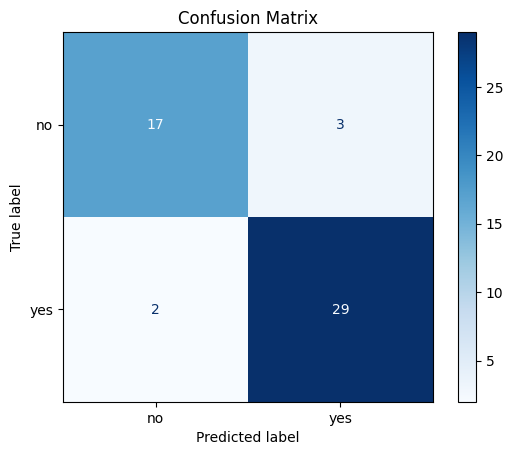
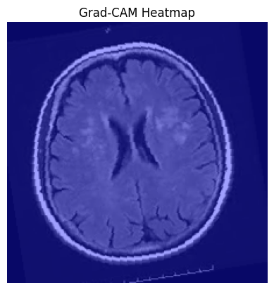

Here's a smart and structured `README.md` for your brain tumor detection project. This version includes sections on project overview, dataset, model, training, evaluation results (with your classification report), Grad-CAM visualization, and usage instructions.

---

# 🧠 Brain Tumor Detection Using Transfer Learning (ResNet50)

## 📌 Overview

This project implements a deep learning pipeline for binary classification of brain MRI images into **"Tumor"** and **"No Tumor"** categories. It uses **transfer learning** with **ResNet50**, along with **Grad-CAM** for visual explanation of the model's predictions.

---

## 📂 Dataset(archive)

* **Location**: `./dataset/`

* **Format**: Folder-based, with subfolders:

  * `yes/`: Images with brain tumors.
  * `no/`: Images without brain tumors.

* **Transformations**:

  * Resize to 224x224
  * Data augmentation: random horizontal flip, rotation, color jitter
  * Normalization with ImageNet mean/std

---

## ⚙️ Model Architecture

* **Backbone**: [ResNet50](https://arxiv.org/abs/1512.03385) pretrained on ImageNet
* **Final Layer**: Replaced with `nn.Linear(in_features, 1)` for binary classification
* **Loss Function**: `BCEWithLogitsLoss` (with class weighting to handle imbalance)
* **Optimizer**: Adam
* **Learning Rate Scheduler**: StepLR (decays every 5 epochs)

---

## 📊 Training Details

* **Epochs**: 15
* **Batch Size**: 16
* **Stratified Split**: 80% training / 20% testing
* **Device**: CUDA (if available)

---

## 🧪 Evaluation Results

Using 20% of the dataset for testing:

* **Accuracy**: 90%
* **Macro F1 Score**: 90%
* **Confusion Matrix**:
   ← *(you can save and link the generated image here)*

---

## 🔍 Grad-CAM Visualization

Grad-CAM is used to highlight regions in the MRI that influenced the model's decision.

<p align="center">
  
</p>

---

## 🚀 How to Run

1. **Install Requirements**:

   ```bash
   pip install -r requirements.txt
   ```

2. **Prepare Dataset**:

   * Place images inside `./dataset/yes/` and `./dataset/no/`.

3. **Train and Evaluate**:

   ```bash
   python main.py
   ```


